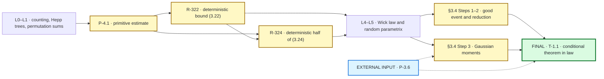
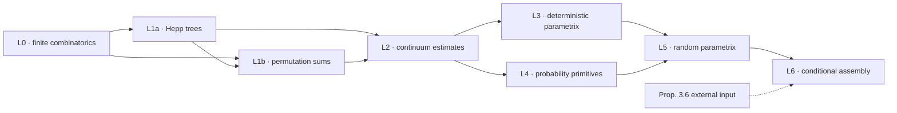
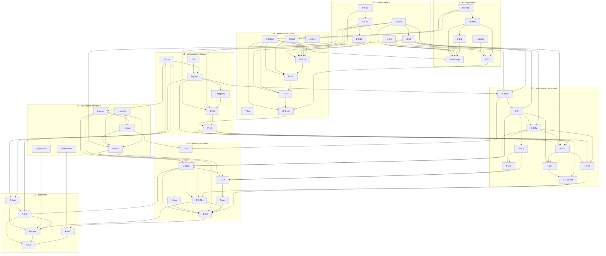

# Anderson4D blueprint: paper → mathematics → Lean

This is the GitHub-native entry point for the formalization blueprint.  It is
designed to render directly in the repository: no local TeX installation and
no GitHub Pages deployment are required.

The tracked LaTeX [blueprint source](blueprint/src/content.tex) remains the
normative mathematical DAG.  This page is its reader-facing navigation layer:
the diagrams show the dependency structure, while the tables provide reliable
one-click links to the blueprint statement and a primary checked Lean
declaration.  The exact paper-number crosswalk is
[PAPER_TO_LEAN](docs/PAPER_TO_LEAN.md).

> **Scope.** The repository proves the conditional finite-mode form of
> Deng--Shen Theorem 1.1.  Paper Proposition 3.6 is represented by the explicit
> hypothesis family
> [Anderson4D.Prop36Family](Anderson4D/Main/External.lean#L155); it is not an
> added Lean axiom.  The final convergence-in-distribution theorem is
> [Anderson4D.main_conditional_law](Anderson4D/Main/Final.lean#L59).

## Quick navigation

| I want to… | Open |
|---|---|
| see the proof spine or the full dependency graph | [Proof at a glance](#proof-at-a-glance) · [complete 53-node DAG](#complete-dag) |
| jump to the load-bearing paper theorems and their checked Lean proofs | [Highlighted theorem crosswalk](README.md#key-results) |
| look up an exact paper formula, definition, lemma, or proposition | [Paper → Lean exact index](docs/PAPER_TO_LEAN.md) |
| inspect all stable node IDs and direct dependencies | [PAPER_MAP](docs/PAPER_MAP.md) |
| read the mathematical statement attached to every node | [complete node directory](#complete-node-directory), with links into the [tracked blueprint chapters](blueprint/src/chapter/) |
| reverse-search a Lean module by its `Paper:` tag | [generated PAPER_INDEX](docs/PAPER_INDEX.md) |
| inspect the delicate §4.2 translation | [Step 4(B) correspondence](docs/PAPER_TO_LEAN.md#step-4b) |
| reproduce the release checks | [`scripts/release_gate.sh`](scripts/release_gate.sh) |

## Proof at a glance



> **Start at Theorem 1.1:**
> [formal law statement](Anderson4D/Main/LawCorollary.lean#L189)
> → [checked conditional proof](Anderson4D/Main/Final.lean#L60)
> ← [explicit external Proposition 3.6 input](Anderson4D/Main/External.lean#L155).
> Follow the arrows backwards for the proof architecture, or use the
> [paper-number index](docs/PAPER_TO_LEAN.md) for an exact lookup.

The architecture has seven dependency layers.  The split between deterministic
profiles (L3) and random chaos kernels (L5) keeps the dependency graph acyclic.



<a id="complete-dag"></a>
### Complete 53-node / 103-edge dependency DAG

<details>
<summary><strong>Expand the complete blueprint DAG</strong></summary>

The edges below are the tracked `\uses{…}` relations from the LaTeX
blueprint.  Diagram nodes are intentionally not used as hyperlinks because
ordinary Markdown links are more reliable in GitHub's sandboxed Mermaid
renderer; use the complete directory immediately after the diagram.



</details>

## Complete node directory

Each row links to the mathematical blueprint statement and one primary Lean
entry point.  Many nodes have several public declarations; follow the same
node in [PAPER_TO_LEAN](docs/PAPER_TO_LEAN.md) for the complete exact list.

### L0 — finite combinatorics

| Node | Mathematical statement | Primary Lean declaration |
|---|---|---|
| [D-pair](blueprint/src/chapter/combinatorics.tex#L7) | Partial pairings; paper Definition 2.2 | [Anderson4D.PartialPairing](Anderson4D/Combinatorics/Pairing.lean#L44) |
| [D-int](blueprint/src/chapter/combinatorics.tex#L17) | Fully paired intervals and primitivity; paper Definition 2.3 | [Anderson4D.IsPrimitive](Anderson4D/Combinatorics/Pairing.lean#L399) |
| [L-5.2](blueprint/src/chapter/combinatorics.tex#L31) | Exponential tree count; paper Lemma 5.2 | [Anderson4D.PlaneTree.card_validTreesAtMost_le](Anderson4D/Combinatorics/TreeCountReal.lean#L237) |
| [D-5.11](blueprint/src/chapter/combinatorics.tex#L48) | Lacunary families; paper Definition 5.11 | [Anderson4D.Lacunary](Anderson4D/Combinatorics/BinomialBounds.lean#L82) |
| [L-5.12](blueprint/src/chapter/combinatorics.tex#L54) | Binomial and multinomial bounds; paper Lemma 5.12 | [Anderson4D.multinomial_le_pow_of_lacunary](Anderson4D/Combinatorics/BinomialBounds.lean#L419) |
| [L-5.13](blueprint/src/chapter/combinatorics.tex#L69) | Sequence counting; paper Lemma 5.13 | [Anderson4D.sum_min_ratio_pow_le](Anderson4D/Combinatorics/SequenceCount.lean#L581) |

### L1a — Hepp trees

| Node | Mathematical statement | Primary Lean declaration |
|---|---|---|
| [D-hepp](blueprint/src/chapter/hepp.tex#L8) | Hepp trees, markings, multiplicities; paper Definitions 5.1 and 5.3 | [Anderson4D.PlaneTree](Anderson4D/HeppTree/Basic.lean#L33) |
| [D-adm](blueprint/src/chapter/hepp.tex#L27) | Admissible embeddings; paper Definition 5.4 | [Anderson4D.IsAdmissible](Anderson4D/HeppTree/Admissible.lean#L158) |
| [L-5.5](blueprint/src/chapter/hepp.tex#L39) | Existence of realizing trees; paper Lemma 5.5 | [Anderson4D.exists_realizing_tree](Anderson4D/HeppTree/Decomposition.lean#L1046) |
| [R-decomp](blueprint/src/chapter/hepp.tex#L50) | Sum decomposition; paper (5.6)–(5.11) | [Anderson4D.sum_eq_sum_paired_tree_incidence_div](Anderson4D/HeppTree/PairedIncidence.lean#L202) |
| [I-cayley](blueprint/src/chapter/hepp.tex#L66) | Parent-function bound used at paper (5.24) | [Anderson4D.weightedCayley_le_of_parent_injection](Anderson4D/ForMathlib/WeightedCayley.lean#L141) |
| [P-5.6](blueprint/src/chapter/hepp.tex#L80) | Volume estimate; paper Proposition 5.6 | [Anderson4D.volume_estimate](Anderson4D/HeppTree/VolumeEstimate.lean#L3502) |

### L1b — permutation sums

| Node | Mathematical statement | Primary Lean declaration |
|---|---|---|
| [D-ledger](blueprint/src/chapter/permsum.tex#L7) | Words and factorial ledger | [Anderson4D.paperSum](Anderson4D/PermSum/Words.lean#L487) |
| [T-toy](blueprint/src/chapter/permsum.tex#L25) | Warm-up estimate; paper (1.14)–(1.15) | [Anderson4D.toy_permSum_bound](Anderson4D/PermSum/Toy.lean#L623) |
| [L-5.14](blueprint/src/chapter/permsum.tex#L39) | Bilinear cluster bound; paper Lemma 5.14 | [Anderson4D.bilinear_cluster_bound](Anderson4D/PermSum/LocalRefined.lean#L1349) |
| [D-leaf](blueprint/src/chapter/permsum.tex#L55) | Simple/compound leaves and gamma invariants; paper Definition 5.8 | [Anderson4D.gamma2](Anderson4D/HeppTree/Leaves.lean#L19) |
| [P-5.10](blueprint/src/chapter/permsum.tex#L65) | Single-scale estimate; paper Proposition 5.10 | [Anderson4D.singleScale_estimate](Anderson4D/PermSum/SingleScale.lean#L542) |
| [P-5.9](blueprint/src/chapter/permsum.tex#L80) | Inductive estimate; paper Proposition 5.9 | [Anderson4D.inductive_estimate](Anderson4D/PermSum/Inductive.lean#L162) |
| [P-5.7](blueprint/src/chapter/permsum.tex#L93) | Permutation-sum estimate; paper Proposition 5.7 | [Anderson4D.permSum_estimate](Anderson4D/PermSum/Main.lean#L314) |
| [R-4.1pf](blueprint/src/chapter/permsum.tex#L106) | Lattice assembly of Proposition 4.1; paper (5.16)–(5.17) | [Anderson4D.primitive_lattice_estimate](Anderson4D/Continuum/PrimitiveFinalAssembly.lean#L1721) |

### L2 — continuum estimates

| Node | Mathematical statement | Primary Lean declaration |
|---|---|---|
| [D-E](blueprint/src/chapter/continuum.tex#L6) | Symmetry class E; paper Definition 2.1 | [Anderson4D.MemEClassR4](Anderson4D/Continuum/Basic.lean#L72) |
| [I-torus](blueprint/src/chapter/continuum.tex#L15) | Paper-normalized torus Fourier core | [Anderson4D.paperKernelCoeff_eq_volume_sq_smul_normalized](Anderson4D/Continuum/TorusFourier.lean#L631) |
| [I-green](blueprint/src/chapter/continuum.tex#L27) | Green kernel and Fourier multiplier; paper (4.1) | [Anderson4D.paperFourierCoeff_greenFn](Anderson4D/Continuum/GreenFourier.lean#L651) |
| [I-singconv](blueprint/src/chapter/continuum.tex#L47) | Singular convolution toolkit | [Anderson4D.triple_conv_invSqKer_le](Anderson4D/Continuum/SingularConv.lean#L1679) |
| [R-51](blueprint/src/chapter/continuum.tex#L59) | Discretization; paper §5.1, (5.1)–(5.5) | [Anderson4D.sum_primitiveInsertedIntegrand_lintegral_le_r51GlobalDecayBound](Anderson4D/Continuum/PrimitiveEndpointPeriodic.lean#L1528) |
| [P-4.1](blueprint/src/chapter/continuum.tex#L70) | Primitive pairing estimate; paper Proposition 4.1 | [Anderson4D.proposition41](Anderson4D/Continuum/PrimitiveProposition41.lean#L204) |

### L3 — deterministic parametrix

| Node | Mathematical statement | Primary Lean declaration |
|---|---|---|
| [D-Kdet](blueprint/src/chapter/detparametrix.tex#L7) | Deterministic profile kernels; paper (3.1)–(3.2) | [Anderson4D.detIntegrand](Anderson4D/DetParametrix/Core/Kernels.lean#L106) |
| [D-RI](blueprint/src/chapter/detparametrix.tex#L18) | Renormalization induction; paper Definition 3.1 | [Anderson4D.detRIkernel](Anderson4D/DetParametrix/Core/Renormalized.lean#L243) |
| [P-3.2](blueprint/src/chapter/detparametrix.tex#L27) | Closed difference-factor formula; paper Proposition 3.2 | [Anderson4D.detRIkernel_eq_prod](Anderson4D/DetParametrix/Core/Renormalized.lean#L303) |
| [D-C2q](blueprint/src/chapter/detparametrix.tex#L38) | Renormalization constants; paper (3.8)–(3.11) | [Anderson4D.renormCEps](Anderson4D/DetParametrix/Core/Kernels.lean#L219) |
| [P-3.3](blueprint/src/chapter/detparametrix.tex#L48) | Closed formula for the constant integrand; paper Proposition 3.3 | [Anderson4D.renormJ_eq_prod](Anderson4D/DetParametrix/Core/Constants.lean#L213) |
| [P-3.5a](blueprint/src/chapter/detparametrix.tex#L54) | Renormalization-constant bound; paper (3.22) | [Anderson4D.R322AnalyticResidualPrefix.exists_r322_renormC2q_bound](Anderson4D/DetParametrix/Paper41_Renorm/R322AnalyticResidualIteration.lean#L2684) |
| [R-322](blueprint/src/chapter/detparametrix.tex#L61) | Reduction machine for (3.22); paper §4.1 | [Anderson4D.R322AnalyticResidualPrefix.exists_r322RenormFiberReductionOutputAE](Anderson4D/DetParametrix/Paper41_Renorm/R322AnalyticResidualIteration.lean#L2468) |
| [P-3.5b-det](blueprint/src/chapter/detparametrix.tex#L71) | Deterministic pairing-sum bound underlying (3.24) | [Anderson4D.deterministic_second_moment_bound](Anderson4D/Main/Final.lean#L27) |
| [R-324](blueprint/src/chapter/detparametrix.tex#L80) | Reduction machine for (3.24); paper §4.2 | [Anderson4D.SmoothCutoff.exists_r324PaperHighWholeSeriesWeightedMajorantBound](Anderson4D/DetParametrix/Paper42_Moment/R324PaperWholeSeriesHighProducer.lean#L3139) |

### L4 — probability primitives

| Node | Mathematical statement | Primary Lean declaration |
|---|---|---|
| [I-noise](blueprint/src/chapter/probability.tex#L6) | Fourier white noise and its mollification | [Anderson4D.NoiseModel.xiEps](Anderson4D/Probability/Noise.lean#L68) |
| [I-isserlis](blueprint/src/chapter/probability.tex#L26) | Isserlis/Wick theorem | [Anderson4D.NoiseModel.integral_coordinateProduct_eq_wickPairingSum](Anderson4D/Probability/NoiseIsserlis.lean#L300) |
| [I-chaos](blueprint/src/chapter/probability.tex#L40) | Chaos projections | [Anderson4D.partialPairingChaosWeight_eq_pairProduct_mul_wickPolynomial](Anderson4D/Probability/ChaosDecomposition.lean#L55) |
| [P-wick](blueprint/src/chapter/probability.tex#L49) | Mollified-noise Wick law; paper (2.3)–(2.4) | [Anderson4D.NoiseModel.integral_xiEpsProduct_eq_wickPairingSum](Anderson4D/Probability/MollifiedWickLaw.lean#L192) |
| [I-gaussmm](blueprint/src/chapter/probability.tex#L64) | Gaussian moment method | [Anderson4D.Prop36.tendsto_fixedTruncationRealMoment](Anderson4D/Main/FixedTruncationGaussian.lean#L480) |
| [I-weakconv](blueprint/src/chapter/probability.tex#L78) | Convergence-in-distribution glue | [Anderson4D.TendstoInDistribution.tendsto_charFun_integral](Anderson4D/Probability/WeakConvGlue.lean#L61) |

### L5 — random parametrix

| Node | Mathematical statement | Primary Lean declaration |
|---|---|---|
| [D-Im](blueprint/src/chapter/parametrix.tex#L7) | Random chaos-expansion kernels; paper (3.1)–(3.2) | [Anderson4D.wickAt](Anderson4D/Parametrix/Random.lean#L38) |
| [D-para](blueprint/src/chapter/parametrix.tex#L17) | Parametrix and operator realization; paper (3.13)–(3.15) | [Anderson4D.parametrixP](Anderson4D/Parametrix/Random.lean#L66) |
| [P-3.4](blueprint/src/chapter/parametrix.tex#L36) | Graded parametrix identity; paper Proposition 3.4 | [Anderson4D.PartialPairing.xi_comp_parametrix](Anderson4D/Parametrix/IdentityGradedComparison.lean#L262) |
| [P-err](blueprint/src/chapter/parametrix.tex#L55) | Left/right error identities; paper (3.20)–(3.21) | [Anderson4D.PartialPairing.leftPreconditionedParametrixAction_eq_green_add_remainder_of_ledger](Anderson4D/Parametrix/IdentityGradedComparison.lean#L288) |
| [P-3.5b](blueprint/src/chapter/parametrix.tex#L69) | Random/Wick half of paper (3.24) | [Anderson4D.parametrix_coeff_bound](Anderson4D/Parametrix/MomentBounds.lean#L509) |
| [P-L2](blueprint/src/chapter/parametrix.tex#L81) | Operator bounds and the good event; paper §3.4 Step 1 | [Anderson4D.MainGoodEvent.nonempty_fixedModeGoodEventData_of_deterministic_bounds](Anderson4D/Main/GoodEventConstruction.lean#L298) |
| [I-l2op](blueprint/src/chapter/parametrix.tex#L93) | Kernel-to-operator bridge | [Anderson4D.paperKernelCoeff_eq_volume_mul_inner_of_action](Anderson4D/Parametrix/L2KernelBridge.lean#L48) |

### L6 — conditional assembly

| Node | Mathematical statement | Primary Lean declaration |
|---|---|---|
| [P-3.6](blueprint/src/chapter/main.tex#L7) | External moment-factorization input; paper Proposition 3.6 | [Anderson4D.Prop36Family](Anderson4D/Main/External.lean#L155) |
| [D-limit](blueprint/src/chapter/main.tex#L28) | Explicit finite-mode Gaussian limit; paper (1.3), (3.25), (3.28) | [Anderson4D.limitVar](Anderson4D/Main/GaussianLimit.lean#L72) |
| [P-red](blueprint/src/chapter/main.tex#L45) | Full-resolvent to parametrix reduction; paper §3.4 Step 2 | [Anderson4D.Prop36.tendsto_fullResolventChar_of_second_moment_and_goodEvent](Anderson4D/Main/GoodEventCharacteristic.lean#L201) |
| [P-mom](blueprint/src/chapter/main.tex#L61) | Gaussian moments and truncation removal; paper §3.4 Step 3 | [Anderson4D.Prop36.tendsto_fullParametrixChar_of_geometric_second_moment_bound](Anderson4D/Main/GeometricTruncation.lean#L231) |
| [T-1.1](blueprint/src/chapter/main.tex#L84) | Conditional finite-vector convergence in distribution; paper Theorem 1.1 | [Anderson4D.main_conditional_law](Anderson4D/Main/Final.lean#L59) |

## §4.2 Step 4(B) translation note

The paper obtains total-frequency decay by selecting a first-large/high slot;
Lean proves the same `<ε²(α+β)>⁻⁸` conclusion by retaining the complete signed
family through Fourier extraction and then applying eight periodic
integrations by parts before the first norm.  This is a proof-organization
difference, not a change to the formalized estimate.  See the
[paper–Lean proof correspondence](docs/R324_PAPER_PROOF.md#step-4b-total-frequency)
and the checked endpoint
[Anderson4D.SmoothCutoff.exists_r324PaperHighWholeSeriesWeightedMajorantBound](Anderson4D/DetParametrix/Paper42_Moment/R324PaperWholeSeriesHighProducer.lean#L3139).

## Maintaining the page

The blueprint contains 53 nodes and 103 tracked dependency edges;
its `\lean{…}` annotations register 167 declarations.  All links on this page
are repository-relative, so GitHub rewrites them for the branch or commit being
viewed.  Validate the navigation layer with:

```sh
python3 scripts/check_doc_links.py
python3 scripts/paper_index.py --check
lake exe checkdecls blueprint/lean_decls
```

The full release gate is `bash scripts/release_gate.sh`.
