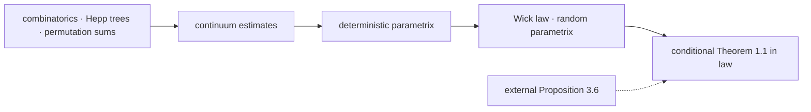
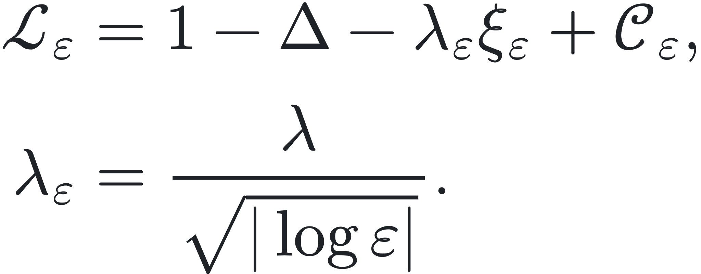
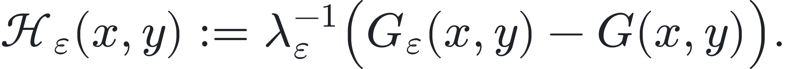
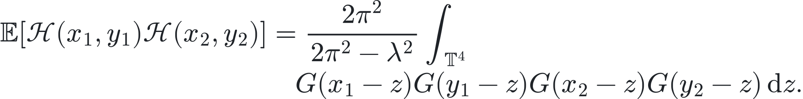

# anderson4d

**[Live project site](https://sairmath.github.io/anderson4d_lean/)** ·
**[Web blueprint & full DAG](https://sairmath.github.io/anderson4d_lean/blueprint/)** ·
**[GitHub-native blueprint](BLUEPRINT.md)** ·
**[Paper → Lean index](docs/PAPER_TO_LEAN.md)** ·
**[Citation](CITATION.cff)** ·
**[Apache-2.0 license](LICENSE)**

A Lean 4 + mathlib formalization of
[*The four-dimensional Anderson model: a case study for critical
SPDEs*](https://arxiv.org/abs/2607.10105) by Yu Deng and Hao Shen (2026).

The repository proves the finite-family convergence-in-distribution form of
paper Theorem 1.1, conditional on the explicit statement of paper
Proposition 3.6. Proposition 3.6 is quoted by Deng--Shen from
Gabriel--Rosati and is represented by an ordinary Lean hypothesis, not an
axiom. Its proof is outside the formalized scope.

## Start here: run and verify the project

Lean files are not run one at a time like scripts. Open the **repository
root** in a Lean-aware editor or IDE, such as VS Code with the Lean 4
extension; it will type-check the file you open and all of its imports. Use
the following setup to verify the entire project from a fresh clone.

### Environment and dependencies

| Requirement | Version / purpose |
|---|---|
| Git | clone the repository |
| [`elan`](https://lean-lang.org/lean4/doc/quickstart.html) | installs and selects the pinned Lean toolchain |
| Lean | **v4.32.1**, fixed by [`lean-toolchain`](lean-toolchain) |
| mathlib | **v4.32.1**, fixed by [`lakefile.toml`](lakefile.toml) and [`lake-manifest.json`](lake-manifest.json) |
| Lean-aware editor or IDE | VS Code with the **Lean 4** extension is one recommended option |
| Bash + Python 3 | required only for `scripts/release_gate.sh` and documentation checks |

You do **not** need to install mathlib or `checkdecls` manually: Lake fetches
the exact project dependencies. Generating the optional blueprint artifacts
additionally uses `leanblueprint`, plasTeX, and Graphviz; the PDF form also
requires TeX Live. None of these are needed to check the Lean proof itself.
The shell scripts assume macOS, Linux, or a Unix-like environment such as WSL
on Windows.

### First build and editor check

1. Install `elan` and configure Lean support in your preferred editor or IDE
   (for example, the **Lean 4** extension in VS Code). `elan` will
   automatically select Lean v4.32.1 when you enter this repository.
2. Clone the repository and open a terminal in its root directory:

   ```sh
   git clone https://github.com/sairmath/anderson4d_lean.git
   cd anderson4d_lean
   lake exe cache get
   lake build
   ```

   `lake exe cache get` downloads the available precompiled mathlib cache;
   `lake build` then checks the complete `Anderson4D` library using the Lean
   version pinned in [`lean-toolchain`](lean-toolchain).
3. Open the repository root in your editor or IDE, then open
   [`Verify.lean`](Verify.lean). Inspect each `#check` command in the editor's
   Lean output view (called **InfoView** in VS Code), and jump to a checked
   declaration to read its implementation. This is the shortest reader-facing
   verification file; the slower, full public axiom audit is part of
   `scripts/release_gate.sh` below.
4. To inspect the actual final proof, open
   [`Anderson4D/Main/Final.lean`](Anderson4D/Main/Final.lean). The final law
   theorem is `Anderson4D.main_conditional_law`; its only non-formalized
   mathematical input is the explicit hypothesis
   `Anderson4D.Prop36Family`.

For the full repository audit—including a clean build, zero-`sorry` scan,
tracked-import check, public axiom audit, documentation links, and blueprint
declarations—run:

```sh
bash scripts/release_gate.sh
```

If `lake build` succeeds and your editor shows no errors in `Verify.lean` or
`Anderson4D/Main/Final.lean`, Lean has accepted the proof and every imported
dependency. The separate `release_gate.sh` command checks the repository's stronger
release and trust policies.

## Read the blueprint and main theorem

The [live web blueprint](https://sairmath.github.io/anderson4d_lean/blueprint/)
provides the fully typeset mathematical text, declaration links, and
[interactive dependency graph](https://sairmath.github.io/anderson4d_lean/blueprint/dep_graph_document.html).
The [GitHub-native blueprint](BLUEPRINT.md) contains the proof spine, the
[complete 53-node / 103-edge DAG](BLUEPRINT.md#complete-dag), and one-click
links from every node to a checked Lean declaration. For an exact lookup by
paper definition, equation, lemma, or proposition, use
[PAPER_TO_LEAN](docs/PAPER_TO_LEAN.md).



The formal law statement and its proof are:

- [Anderson4D.MainLawStatement](Anderson4D/Main/LawCorollary.lean#L189) —
  finite families of Fourier modes converge in distribution to the explicit
  Gaussian law;
- [Anderson4D.main_conditional_law](Anderson4D/Main/Final.lean#L59) — the
  checked conditional proof;
- [Anderson4D.Prop36Family](Anderson4D/Main/External.lean#L155) — the sole
  external hypothesis, represented as an ordinary `Prop`, not an axiom.

The characteristic-function counterpart is
[Anderson4D.main_conditional](Anderson4D/Main/Final.lean#L47).

## Mathematical statement

Let ξ be spatial white noise on the four-torus
𝕋<sup>4</sup> = [−π, π]<sup>4</sup>, let
ξ<sub>ε</sub> = ρ<sub>ε</sub> ∗ ξ, and set

<p align="center">
  <picture>
    <source media="(prefers-color-scheme: dark)" srcset="docs/assets/readme-operator-dark.svg">
    
  </picture>
</p>

Here 𝒞<sub>ε</sub> is an explicit sum of a number of renormalization
constants that diverges as ε → 0. For sufficiently small λ, the paper
proves that

<p align="center">
  <picture>
    <source media="(prefers-color-scheme: dark)" srcset="docs/assets/readme-field-dark.svg">
    
  </picture>
</p>

converges in law to a centered Gaussian field with covariance

<p align="center">
  <picture>
    <source media="(prefers-color-scheme: dark)" srcset="docs/assets/readme-covariance-dark.svg">
    
  </picture>
</p>

The formal target is the corresponding statement for every finite family of
Fourier modes. The resolvent coefficients come from the genuine bounded
Fredholm inverse, totalized to zero off its invertibility event; they are not
defined by an unconditional Neumann series.

<a id="key-results"></a>
## Key formalized results

The table lists the load-bearing paper endpoints. The complete crosswalk,
including definitions and auxiliary lemmas, is
[PAPER_TO_LEAN](docs/PAPER_TO_LEAN.md).

| Paper result | Blueprint node | Checked Lean endpoint |
|---|---|---|
| Theorem 1.1, conditional law form | [T-1.1](blueprint/src/chapter/main.tex#L84) | [MainLawStatement](Anderson4D/Main/LawCorollary.lean#L189) → [main_conditional_law](Anderson4D/Main/Final.lean#L60) |
| Proposition 3.5, bound (3.22) | [P-3.5a](blueprint/src/chapter/detparametrix.tex#L54) | [exists_r322_renormC2q_bound](Anderson4D/DetParametrix/Paper41_Renorm/R322AnalyticResidualIteration.lean#L2684) |
| Proposition 3.5, bound (3.24) | [P-3.5b-det](blueprint/src/chapter/detparametrix.tex#L71) → [P-3.5b](blueprint/src/chapter/parametrix.tex#L69) | [deterministic_second_moment_bound](Anderson4D/Main/Final.lean#L28) → [parametrix_coeff_bound](Anderson4D/Parametrix/MomentBounds.lean#L510) |
| Proposition 3.6 — external input | [P-3.6](blueprint/src/chapter/main.tex#L7) | [Prop36Family](Anderson4D/Main/External.lean#L155) (statement only) |
| Proposition 4.1 | [P-4.1](blueprint/src/chapter/continuum.tex#L70) | [proposition41](Anderson4D/Continuum/PrimitiveProposition41.lean#L204) |
| Proposition 5.6, volume estimate | [P-5.6](blueprint/src/chapter/hepp.tex#L80) | [volume_estimate](Anderson4D/HeppTree/VolumeEstimate.lean#L3502) |
| Proposition 5.7, permutation sum | [P-5.7](blueprint/src/chapter/permsum.tex#L93) | [permSum_estimate](Anderson4D/PermSum/Main.lean#L314) |
| Proposition 5.9, inductive estimate | [P-5.9](blueprint/src/chapter/permsum.tex#L80) | [inductive_estimate](Anderson4D/PermSum/Inductive.lean#L162) |
| Proposition 5.10, single-scale estimate | [P-5.10](blueprint/src/chapter/permsum.tex#L65) | [singleScale_estimate](Anderson4D/PermSum/SingleScale.lean#L542) |

All rows except Proposition 3.6 are proved without `sorry` or
project-specific axioms. Proposition 3.6 is quoted by Deng--Shen from
Gabriel--Rosati and remains visible as the theorem's explicit premise.

## Important files

| Path | Purpose |
|---|---|
| [BLUEPRINT.md](BLUEPRINT.md) | GitHub-rendered proof architecture, full DAG, and node directory |
| [blueprint/src/](blueprint/src/) | normative leanblueprint mathematical statements and `\uses`/`\lean` annotations |
| [docs/PAPER_TO_LEAN.md](docs/PAPER_TO_LEAN.md) | exact paper-number ↔ public Lean declaration crosswalk |
| [docs/PAPER_MAP.md](docs/PAPER_MAP.md) | stable node IDs and mathematical dependencies |
| [docs/DESIGN.md](docs/DESIGN.md) | formalization scope, normalization, and architecture decisions |
| [docs/PAPER_NOTES.md](docs/PAPER_NOTES.md) | localized notes on the arXiv v1 text and formalization choices |
| [docs/R324_PAPER_PROOF.md](docs/R324_PAPER_PROOF.md) | detailed correspondence for the delicate proof of (3.24) |
| [umbrella `Anderson4D.lean`](Anderson4D.lean) | exhaustive root import for the complete checked library |
| [Anderson4D/Main/Final.lean](Anderson4D/Main/Final.lean) | final deterministic bound and conditional main-theorem proofs |
| [Anderson4D/](Anderson4D/) | Lean source tree |
| [scripts/release_gate.sh](scripts/release_gate.sh) | aggregate release/trust audit |

Source directories follow the paper: `Combinatorics/`, `HeppTree/`, and
`PermSum/` contain the discrete core; `Continuum/` and `DetParametrix/`
contain Sections 3--5; `Probability/` and `Parametrix/` contain the random
layer; and `Main/` contains the conditional assembly.

## Build and trust checks

The project uses the Lean toolchain pinned in [lean-toolchain](lean-toolchain).
From the repository root:

```sh
lake build
bash scripts/release_gate.sh
```

Documentation checks can be run separately:

```sh
python3 scripts/paper_index.py --check
python3 scripts/check_doc_links.py
lake exe checkdecls blueprint/lean_decls
```

The release gate checks the root build, tracked imports, the zero-`sorry` and
banned-token policies, blueprint declarations, documentation indexes, and the
axioms of the public theorem spine. The audited public theorems use only
Lean's standard `propext`, `Classical.choice`, and `Quot.sound`; the repository
contains no project-specific `axiom` declarations and no `native_decide` in
the formalization.

## References

- Y. Deng and H. Shen, *The four-dimensional Anderson model: a case study for
  critical SPDEs*, [arXiv:2607.10105](https://arxiv.org/abs/2607.10105).
- S. Gabriel and T. Rosati, *Fluctuations in the weakly coupled 4D Anderson
  Hamiltonian*, [arXiv:2602.22509](https://arxiv.org/abs/2602.22509).

## Authors and citation

This formalization is credited to Yu Deng, Hao Shen, and `sairmath`. The
mathematical source is the Deng--Shen paper cited above. Citation metadata is
provided in [`CITATION.cff`](CITATION.cff); a release DOI can be added there
after the public archival release is created.

## License

This project is licensed under the [Apache License 2.0](LICENSE).
